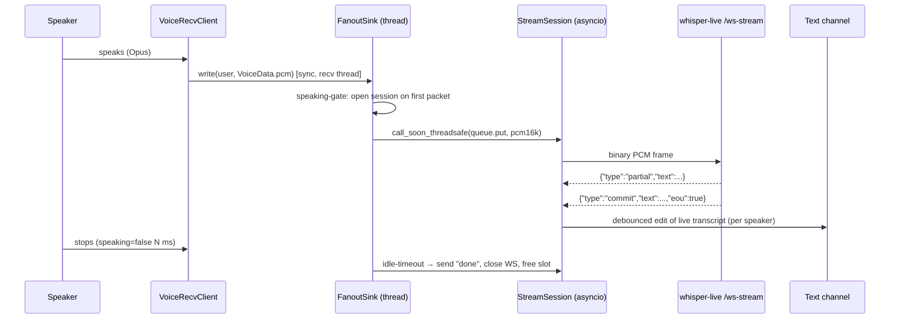

# Discord Voice-Call Live Transcription — Implementation Plan

Date: 2026-06-18
Status: IN PROGRESS — Phase 0
Author: erfi

## Progress tracker

| Phase | State | Notes |
|---|---|---|
| 0 — deps + decode proof | ✅ code + tests done | voice.py (guarded import, numpy resample/mix/SilenceInjector, feature-flagged connect+BasicSink), deps+libopus, 16 unit/structural tests green. Live in-call verify + py3.13 image-build gate pending. |
| 1 — single mixed-stream MVP | ⬜ not started | |
| 2 — per-user attribution | ⬜ not started | |
| 3 — summary on leave | ⬜ not started | |
| 4 — polish | ⬜ not started | |

_Updated as each phase lands. ✅ done · 🚧 in progress · ⬜ not started._

## 1. Goal

Add a bot capability to **join a Discord voice channel and live-transcribe the
call**, posting a running, speaker-attributed transcript to a text channel, and
optionally producing a summary (via the existing `summarize()` pipeline) when it
leaves.

This reuses the already-deployed `whisper-live` streaming backend. The only
genuinely new capability is **receiving Discord voice** — everything downstream
(streaming ASR, LocalAgreement commit/partial, summarisation) already exists.

### Non-goals (initial release)

- Playback / TTS into the call (we only listen).
- Persisting call recordings to disk (transcript only; audio is transient).
- Replacing the existing URL-based `live` job kind (that stays as-is).
- Per-word timestamps in the call transcript (commit text only).

## 2. Research findings (verified, not assumed)

### 2.1 whisper-live already exposes the right endpoint

`whisper-live/server.py` → `WS /ws-stream`:
- Client streams **raw 16 kHz mono int16 PCM as binary frames**.
- Server replies `{"type":"commit","text","eou"}` (stable) and
  `{"type":"partial","text"}` (provisional).
- Send text `"done"` (or disconnect) to flush + close.
- Capacity gate: `LIVE_MAX_STREAMS` (default 4); each WS consumes one slot;
  returns `{"type":"error","message":"server at capacity"}` + close 1013 when full.
- One shared model instance (`LIVE_MODEL`, currently `large-v3`) serves **all**
  streams — concurrency adds GPU queueing, not parallel models.

This is the same endpoint the SPA Live tab uses (proxied as `/api/live/stream`).
The bot is on the same Docker network and reaches it **directly** at
`{WHISPER_LIVE_WS}/ws-stream` (it already uses `{WHISPER_LIVE_WS}/ws-url` for the
URL-livestream path — see `bot/main.py:4551`).

### 2.2 discord.py voice receive — the gap and the fix

- **discord.py stable cannot receive voice.** Deliberate, long-standing omission.
- Fix: **`discord-ext-voice-recv`** (v0.5.2a179, Jun 2025), by `imayhaveborkedit`
  (discord.py's voice maintainer). PyPI `discord-ext-voice-recv`. MIT. Python ≥3.8.
  Status is **alpha** — "no guarantees for stability or random breaking changes."
  We pin exactly and treat upgrades as deliberate.
- API (mirrors the `AudioSource` send API, inverted):
  ```python
  from discord.ext import voice_recv
  vc = await channel.connect(cls=voice_recv.VoiceRecvClient)
  vc.listen(MySink())            # start receiving
  vc.stop_listening()            # stop
  vc.get_speaking(member)        # Discord's own VAD (green-circle) state
  ```
  ```python
  class MySink(voice_recv.AudioSink):
      def __init__(self): super().__init__()
      def wants_opus(self) -> bool: return False   # False => decoded PCM
      def write(self, user, data: voice_recv.VoiceData): ...  # data.pcm
      def cleanup(self): ...
  ```
- **Critical threading note:** `write()` (and sink event listeners) are dispatched
  **from a separate thread and must be synchronous**. To hand audio to asyncio we
  must `loop.call_soon_threadsafe(...)` / a thread-safe queue — never `await`
  inside `write()`.
- **Per-user routing:** by default *all* users' audio hits the one root sink;
  `data.user` identifies the speaker. For per-user streams we keep a
  `dict[user_id -> StreamSession]` inside a custom fan-out sink (the documented
  pattern in issue #23). Discord delivers **separate per-SSRC audio**, so
  simultaneous speakers do NOT mix — we get clean per-user PCM.
- **Discord gives us VAD for free:** `get_speaking()` + speaking events tell us
  when a user starts/stops talking. We gate per-user whisper-live streams on this
  instead of writing our own VAD.

### 2.3 PCM format from the extension

Discord voice PCM (when `wants_opus()==False`): **48 kHz, 16-bit signed, stereo**,
20 ms frames (3840 bytes = 960 samples × 2ch × 2B). whisper-live wants **16 kHz
mono int16**. Conversion = stereo→mono downmix + 3:1 decimation (48000/16000 = 3).

### 2.4 Bot image constraints (the awkward bits)

`bot/Dockerfile` is `python:3.13-slim`; `bot/requirements.txt` is only
`discord.py>=2.7,<3` + `aiohttp`. Consequences:
- **No PyNaCl** (discord.py installed without `[voice]`). Voice needs it.
- **No `libopus`** system lib in the slim image. Opus decode needs it.
- **No ffmpeg** in the bot image (it offloads media work to whisper-live).
- **`audioop` is REMOVED in Python 3.13** — the classic Discord resample helper
  (`audioop.ratecv` / `audioop.tomono`) is gone. **Resolved: use `numpy`** (not
  `audioop-lts`). Rationale: the dev/test host is **Python 3.14** (audioop also
  gone there), tests run via bare `python3 tests/test_regression.py`, and
  **numpy 2.4.2 is already importable on the host** — so a numpy resampler is
  unit-testable as-is, while an audioop-lts resampler would fail to import in the
  test env. numpy downmix + decimate-by-3 (block-average) is adequate
  anti-aliasing for 16 kHz speech ASR. Cost in the bot image: ~20 MB. Acceptable.

### 2.5 Intents & commands

- `bot/main.py:1332` uses `Intents.default()` + `message_content=True`.
  `voice_states` is **non-privileged and already enabled** by `default()`. Good —
  no re-auth needed for voice state.
- `members` intent is privileged and **not** enabled; we avoid needing it by using
  `data.user` / `voice_state` members directly.
- The bot is `commands.Bot(command_prefix="!")` and runs **11 `@bot.tree.command`
  slash commands** (`/summarize`, `/transcribe`, `/status`, …) — slash is the
  bot's **native idiom**. The `403 Forbidden (50001) Missing Access` in the logs
  is **one guild missing the `applications.commands` scope**, NOT a global slash
  failure (the bot's whole UX depends on slash working in its main guild). →
  Voice feature uses **slash commands** (`/transcribe-join` / `/transcribe-leave`)
  for consistency; `!`-prefix commands are an available fallback. Fixing the one
  guild's invite scope is a separate task.
- **Python-version risk cluster:** the bot image is `python:3.13-slim`;
  `discord-ext-voice-recv` is **alpha** and its PyPI classifiers list only
  Python 3.8–3.12 (not 3.13). The wheel is `py3-none-any` with
  `requires_python>=3.8` (no upper bound) so pip WILL install it on 3.13, but the
  author hasn't tested 3.13. **Decision:** stay on `python:3.13-slim` + numpy and
  **verify the extension actually works on 3.13 in Phase 0**; if it misbehaves,
  fall back to pinning the bot image to `python:3.12-slim` (extension is
  classifier-supported there). The extension is import-stubbed in the test suite,
  so the 3.14 test host is irrelevant to it.

## 3. Architecture

Data flow (see `voice-transcribe-dataflow.svg`):

```
Discord VC ──Opus per-SSRC──▶ VoiceRecvClient ──VoiceData(user,pcm)──▶ FanoutSink
   FanoutSink ─(only while user speaking)─▶ resample 48k stereo → 16k mono
   ─▶ per-user StreamSession ──binary PCM──▶ whisper-live /ws-stream (1 WS/speaker)
   whisper-live ──commit/partial──▶ StreamSession ──▶ live message editor ──▶ text chan
```



### Components (all new, isolated in `bot/voice.py`)

1. **`VoiceSessionManager`** — one per guild. Owns the `VoiceRecvClient`, the
   fan-out sink, the live message handle, the combined transcript, and the set of
   active per-user `StreamSession`s. Lifecycle: `join()` / `leave()`.

2. **`FanoutSink(voice_recv.AudioSink)`** — `wants_opus()==False`. `write()` runs
   on the recv thread: looks up/creates the speaker's `StreamSession`, resamples
   the 20 ms frame, and `loop.call_soon_threadsafe`-pushes it into that session's
   bounded `asyncio.Queue` (drop-oldest on overflow so we never block the recv
   thread). Speaking-stop events (or an idle timer) close the session.

3. **`StreamSession`** — owns ONE `aiohttp` WS to `whisper-live/ws-stream`. Two
   coroutines: a **sender** draining the queue → binary frames; a **receiver**
   reading commit/partial JSON → updates this speaker's text and signals the
   manager to re-render. On close: send `"done"`, drain final commit, release the
   capacity slot.

4. **`resample_48k_stereo_to_16k_mono(pcm: bytes) -> bytes`** — pure function
   (**numpy**): reshape to stereo, mean→mono, block-average decimate 3:1. Pure
   and deterministic → the main unit-test target.

6. **`SilenceInjector` (per session)** — Discord sends NO packets during silence,
   and the extension's `SilenceGeneratorSink` is documented broken. whisper-live
   detects end-of-utterance from **trailing silence**, so we must reconstruct it:
   track wall-clock of the last packet; when the next packet arrives after a gap
   > one frame, enqueue the right number of **zero samples** before it so
   whisper-live's VAD sees the real pause and fires `eou`. Without this,
   utterances glue together. Pure/deterministic → unit-tested.

5. **Live renderer** — debounced (≈1 s) editor that composes per-speaker committed
   text into one message (`**Alice:** …` / `**Bob:** …`), chunked via the existing
   `send_long_embed` when it overflows 4096 chars.

### Why NOT a Valkey `Job` kind

The existing kinds (`video/web/litmus/image/live`) are **one-shot, queued,
serialised on the single GPU FIFO**. A voice call is **long-lived, interactive,
multi-stream, and stateful** — it must not occupy the transcription FIFO for its
whole duration. So this is a **session subsystem (a Cog)**, parallel to the queue,
talking straight to `whisper-live` (which has its own `LIVE_MAX_STREAMS` capacity
pool, separate from the batch GPU worker). On `/leave` we *optionally* hand the
collected transcript to the normal `summarize()` path to post a summary — that's
the only touch-point with the existing pipeline.

## 4. Capacity & model strategy

- **Shared pool contention (IMPORTANT):** the SPA Live tab uses the SAME
  `whisper-live` pool (`/api/live/stream` → `/ws-stream`, `LIVE_MAX_STREAMS=4`).
  A 3-speaker call leaves only 1 slot for the browser Live tab (or starves it).
  Options: (a) accept + document; (b) give voice its own budget by raising
  `LIVE_MAX_STREAMS` and reserving N; (c) a second `whisper-live` instance for the
  voice path. Phase-1 mixed-stream (below) sidesteps this entirely (1 slot total).
- Each speaking user = 1 `whisper-live` stream slot. `LIVE_MAX_STREAMS=4` today.
- **Gate on Discord speaking-state** so only *actively talking* users hold a slot;
  typical concurrent speakers in a call = 1–2. Idle-timeout (e.g. 3 s of silence)
  closes a slot so it returns to the pool.
- Hard cap: if all slots are busy, the manager queues the speaker's audio briefly
  or drops with a one-time "at capacity" notice — never blocks the recv thread.
- All streams share the single `LIVE_MODEL`. `large-v3` greedy at 0.6 s cadence is
  fine for 1–2 speakers; if multi-speaker latency is poor, options (in order):
  1. raise `LIVE_MAX_STREAMS` (5090 has headroom) and measure;
  2. switch `LIVE_MODEL=large-v3-turbo` for lower per-pass latency;
  3. (later) a dedicated second `whisper-live` instance for the voice path.
  Start shared, cap at 2–3 concurrent, measure before adding infra.

## 5. Dependencies & image changes

`bot/requirements.txt` (+3):
```
discord.py[voice]>=2.7,<3        # add [voice] extra → pulls PyNaCl
discord-ext-voice-recv==0.5.2a179 # EXACT pin (alpha; deliberate upgrades only)
numpy>=2,<3                       # 48k-stereo → 16k-mono resample + silence pad
```
(numpy chosen over audioop-lts: testable on the 3.14 dev host, avoids the
removed-stdlib-audioop trap on 3.13/3.14.)

`bot/Dockerfile` — add the opus system lib before pip install:
```dockerfile
RUN apt-get update \
 && apt-get install -y --no-install-recommends libopus0 \
 && rm -rf /var/lib/apt/lists/*
```
(`libopus0` is the runtime lib; discord.py loads it via `discord.opus._load_default()`.
No ffmpeg needed — we resample in-process with numpy.)

Deploy: `make build-bot && make recreate-bot` (env unchanged, but recreate is the
project convention for the bot; in-place restart doesn't re-read env).

## 6. Consent / ToS (non-optional)

Recording/transcribing a voice call has legal (two-party-consent jurisdictions)
and Discord-ToS implications. Required behaviour:
- On join, post a **visible** notice in the text channel and (if possible) the
  voice channel: "🔴 This call is being transcribed. Leave the channel if you do
  not consent." Pin it for the session.
- Require an explicit invoker (a member already in the channel runs the command);
  do not auto-join.
- `/leave` (or empty channel) stops immediately and stops listening.
- Document this in `bot/AGENTS.md` and the command help text.
- Optional hardening (later): per-user opt-out that adds them to a `UserFilter`
  so their audio is dropped before resampling.

## 7. File-by-file changes with TDD checkpoints

The bot test suite (`tests/test_regression.py`) stubs `discord` + `aiohttp` and
tests at the function level — no live Discord. So we TDD the **pure / stateful
logic** and use grep-style structural assertions for the wiring (the repo's
existing convention, e.g. `test_api_*_route_registered`).

### 7.1 `bot/voice.py` (new) — the whole subsystem

Kept in its own module so it can't regress the existing flows and so it's trivial
to feature-flag. Public surface: `VoiceSessionManager`, `FanoutSink`,
`StreamSession`, `resample_48k_stereo_to_16k_mono`, `register_voice_commands(bot)`.

**TDD checkpoints (write tests first in a new `─── Voice transcription ───`
section of `tests/test_regression.py`):**

1. `test_resample_48k_stereo_to_16k_mono_ratio` — feed 48000 stereo samples
   (1 s), assert output ≈16000 mono samples (±1 frame), int16, length even.
2. `test_resample_preserves_converter_state` — two successive half-second frames
   through one session produce the same bytes as one combined frame (no click at
   the boundary; `ratecv` state carried).
3. `test_resample_silence_is_silence` — all-zero in → all-zero out (no DC offset).
4. `test_speaking_gate_opens_on_first_packet` — state machine: first packet for a
   user → session created; assert manager tracks it.
5. `test_speaking_gate_closes_after_idle` — no packets for `IDLE_MS` → session
   marked for close (simulate clock).
6. `test_fanout_routes_per_user` — packets from two user-ids create two distinct
   sessions; bytes routed to the correct queue.
7. `test_fanout_write_never_blocks` — full queue → `write()` drops oldest and
   returns immediately (no exception, no await).
8. `test_transcript_aggregator_orders_by_speaker` — commit events from two users
   render `**Name:**`-prefixed lines; long output chunks via `send_long_embed`.
9. `test_capacity_guard_emits_notice_once` — when slots exhausted, one notice, not
   per-frame spam.
10. `test_silence_injector_pads_gaps` — a 1 s wall-clock gap between two packets
    yields ~16000 zero samples enqueued before the second packet; no padding when
    packets are contiguous; padding capped at a max (don't pad a 10-min idle).
11. `test_mixed_stream_sums_and_clips` — two simultaneous speakers sum to one
    mono buffer with int16 clipping (no overflow wrap).

### 7.2 `bot/main.py` — wiring only (minimal, additive)

- Import + `register_voice_commands(bot)` in `setup_hook` / on-ready, behind an
  env flag `VOICE_TRANSCRIBE_ENABLED` (default off) so deploy is safe.
- `discord.opus._load_default()` at startup; log a clear warning if it fails
  (missing libopus) and disable the feature rather than crash.
- New constants: `PROCESSING_EMOJI_VOICE` (reuse 🎙️ or pick a distinct glyph),
  `VOICE_IDLE_MS`, `VOICE_MAX_SPEAKERS`, `VOICE_RENDER_DEBOUNCE_S`.

**TDD checkpoints (grep-style, matching `test_app_*`):**
12. `test_voice_feature_flag_gated` — `VOICE_TRANSCRIBE_ENABLED` guards
    registration in `main.py`.
13. `test_voice_uses_ws_stream_not_ws_url` — `voice.py` connects to
    `/ws-stream` (binary PCM), distinct from the existing `/ws-url` path.
14. `test_voice_opus_load_guarded` — `discord.opus._load_default()` is wrapped in
    try/except with feature-disable on failure.
15. `test_voice_consent_notice_present` — the join handler sends a consent notice
    string (assert the literal is in source).

### 7.3 `bot/requirements.txt` + `bot/Dockerfile`

- Add the three deps + `libopus0` apt line (section 5).
- `test_bot_requirements_declare_voice_deps` — assert `discord.py[voice]`,
  `discord-ext-voice-recv`, `numpy` present in requirements.
- `test_bot_dockerfile_installs_libopus` — assert `libopus0` in Dockerfile.

### 7.4 `bot/AGENTS.md` + command help

- Document the voice subsystem, the consent requirement, the feature flag, the
  capacity model, and the deploy command (`make build-bot && make recreate-bot`).

## 8. Phasing (ship incrementally, each phase independently verifiable)

- **Phase 0 — deps & decode proof.** Add deps + libopus, `discord.opus` loads,
  `VoiceRecvClient` connects, a `BasicSink` logs "got packet from <user>". Proves
  the receive path end-to-end. (No whisper-live yet.)
- **Phase 1 — single MIXED-stream MVP.** Sum all speakers → one 16 kHz mono
  stream (with silence injection), one `StreamSession` to `/ws-stream`, post
  committed text live. `/transcribe-join` + `/transcribe-leave` + consent notice.
  No attribution yet. Uses exactly **1** whisper-live slot → no contention.
  (Single-speaker is unrealistic for a call; mixed handles multi-party from day 1.)
- **Phase 2 — per-user attribution.** FanoutSink + speaking-gate + per-user
  sessions + `**Name:**` rendering + capacity guard against `LIVE_MAX_STREAMS`.
- **Phase 3 — summary on leave.** Feed combined transcript to `summarize()`, post
  via `send_long_embed` / `resolve_summary_channel`.
- **Phase 4 — polish.** Idle-timeout tuning, per-user opt-out (`UserFilter`),
  reconnect on whisper-live drop, metrics/logging, model-latency tuning.

## 9. Risks & open decisions

| Risk / decision | Mitigation / recommendation |
|---|---|
| **Silence gaps** — Discord sends no packets when quiet; whisper-live needs trailing silence for eou; built-in `SilenceGeneratorSink` is broken | `SilenceInjector` reconstructs silence from wall-clock gaps before forwarding. Unit-tested. **#1 technical risk.** |
| **Shared capacity** — SPA Live tab + voice share the 4-slot pool | Phase 1 mixed = 1 slot; Phase 2 gate + cap; raise `LIVE_MAX_STREAMS` or 2nd instance if needed. |
| `discord-ext-voice-recv` is **alpha**, not classifier-tested on py3.13 | Exact pin; isolated in `voice.py`; **verify on 3.13 at Phase 0**, else pin image to py3.12-slim. |
| Sink `write()` is on a **non-async thread** | Strict rule: `write()` only does resample + `call_soon_threadsafe`; zero awaits, zero blocking I/O. Tested (checkpoint 7). |
| **Capacity**: many speakers > `LIVE_MAX_STREAMS` | Speaking-gate + idle-timeout + hard cap + one-time notice. Start cap 2–3, measure. |
| Multi-speaker **GPU latency** on shared model | Measure on `large-v3`; fall back to `large-v3-turbo` or raise max_streams; dedicated instance only if needed. |
| **Slash 403** is per-guild scope, not global | Use slash (bot's native idiom); re-invite the one guild with `applications.commands` separately. |
| **Consent / ToS** | Mandatory visible notice on join; explicit invoke; opt-out later. (§6) |
| numpy block-average decimation is crude anti-aliasing | Fine for 16 kHz speech ASR; whisperX is robust to mild aliasing. Add a proper FIR only if accuracy suffers. |
| Bot image grows (PyNaCl + libopus) | ~a few MB; acceptable. No ffmpeg added. |
| Reconnect if whisper-live restarts mid-call | Phase 4: StreamSession re-dials on WS drop, replays nothing (live is lossy by design). |

## 10. Decisions locked for the spike (Phase 0–1)

- Library: **`discord-ext-voice-recv`** (not a Pycord migration), verify on py3.13.
- Resample: **numpy** downmix + decimate-3 (+ wall-clock silence injection).
- Trigger: **slash commands** (`/transcribe-join` / `/transcribe-leave`).
- Phase 1 = **single mixed stream** (1 slot, no attribution); attribution = Phase 2.
- Integration: **session Cog**, NOT a Valkey Job kind; talks to
  `whisper-live/ws-stream` directly.
- Feature-flagged **off** by default (`VOICE_TRANSCRIBE_ENABLED`).
- Consent notice is part of Phase 1, not deferred.

## 11. Verification before "done"

- `python3 tests/test_regression.py` → all pass (incl. new voice tests).
- `make lint` (compile + compose-check + bot import).
- Manual: invoke in a real voice channel, confirm consent notice, confirm live
  transcript, confirm `/leave` summary, confirm slot release (whisper-live
  `/health` `active_streams` returns to 0).
- `make build-bot && make recreate-bot`; tail `make logs-bot` for opus-load +
  WS-connect confirmation.
